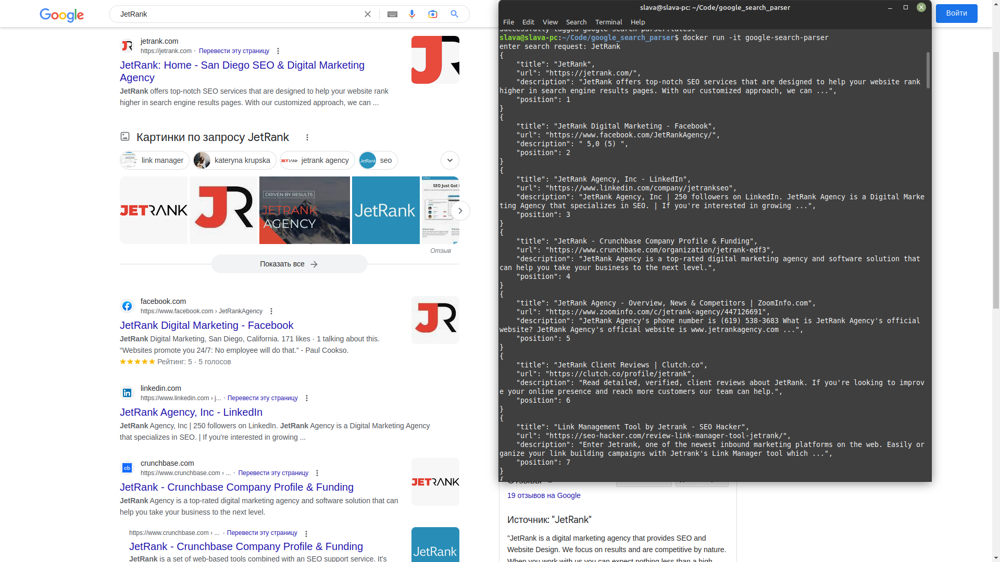

# google_search_parser
Test task for parsing data from google search

#How to run:

## With docker:

### Build a container image:
```bash
docker build -t google-search-parser .
```

### Run docker container:
```bash
docker run -it google-search-parser
```

## Without docker:

### Virtual environment
You can do this using a virtual environment, after activating it.
```bash
python3 -m virtualenv venv;
source venv/bin/activate;
```

### Install dependencies
Next, you need to install dependencies from requirements.txt:
```bash
python -m pip install -r requirements.txt
```

### After run the code
```bash
python parser/parsing.py
```

# Disclaimer:
Depending on the account used, cookie data, IP address (geoposition),
the data in the browser may differ from the results of the program.

# Usage example:

